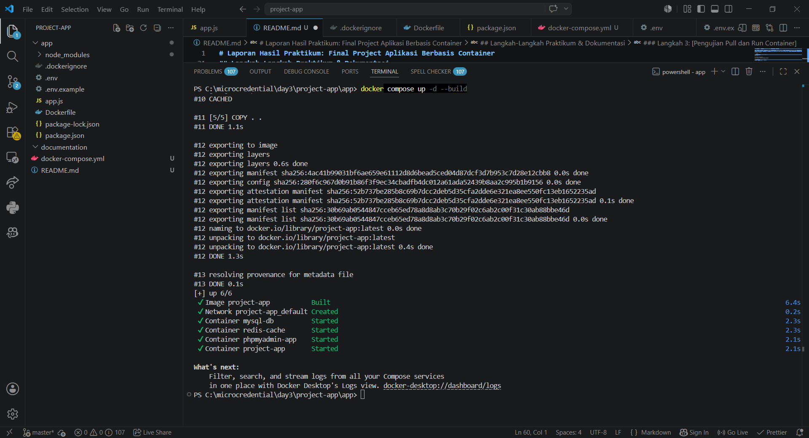

# Laporan Hasil Praktikum: Final Project Aplikasi Berbasis Container

## Identitas Mahasiswa

- **Nama: I Wayan Astawa Putra**
- **NIM: 2415354028**
- **Kelas/Rombel: 4TRPLD**
- **Tanggal Praktikum: 20 Mei 2026**

---

## Teknologi & Tools yang Digunakan

- **Sistem Operasi: Asus OS Windows**
- **Containerization: Docker & Docker Hub**
- **Bahasa Pemrograman / Framework: Node.js**
- **Tools Lain: VS Code, Git**

---

## Langkah-Langkah Praktikum & Dokumentasi

### Langkah 1: Membuat Dockerfile dan Konfigurasi Aplikasi

Pada langkah pertama, dilakukan proses inisialisasi project Node.js serta instalasi dependency yang dibutuhkan seperti Express, MySQL2, dan Dotenv. Setelah itu dibuat file `Dockerfile` dan `docker-compose.yml` untuk menjalankan aplikasi menggunakan container Docker.

````bash
# Inisialisasi project Node.js
npm init -y

# Install dependency
npm install express mysql2 dotenv

# Menjalankan docker compose
docker compose up -d --build

# Build image docker
docker build -t app-good .

**Dokumentasi/Screenshot:**


---

### Langkah 2: [Tulis Nama Langkah 2, Contoh: Tag dan Push ke Docker Hub]

Jelaskan proses penamaan ulang _image_ dan proses unggah ke Docker Hub milik Anda.

```bash
docker tag project-app astawaputra/project-app
docker push astawaputra/project-app
````

**Dokumentasi/Screenshot:**


---

### Langkah 3: [Pengujian Pull dan Run Container]

Langkah terakhir adalah melakukan pengujian dengan menjalankan container dari image yang telah diunggah ke Docker Hub. Pengujian dilakukan untuk memastikan aplikasi dapat berjalan dengan baik pada environment lain.

```bash
docker run -d -p 8080:8080 madedianpp/app-good:v1.0
```

---

## Kesimpulan

Tuliskan kesimpulan singkat atau kendala yang Anda hadapi beserta solusinya selama melakukan praktikum ini di sini.
